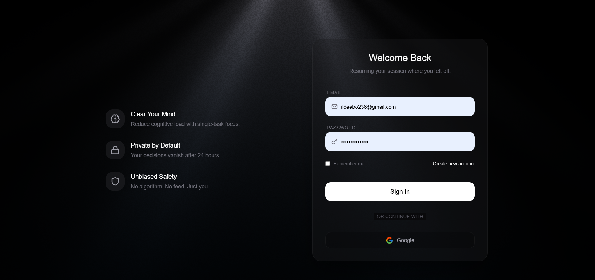

# Step One | Decision Recovery

**Step One** is a minimalist decision recovery platform designed to combat decision fatigue and cognitive overload. It forces a "one decision per day" discipline, helping users focus on the single most important action they can take to improve their tomorrow.

## Presentation — Login / Welcome



*Welcome screen: Clear Your Mind, Private by Default, Unbiased Safety — with email/password and Google sign-in.*

## Core Philosophy

In a world of infinite choices, **Step One** limits you to a single, high-impact commitment.
- **Identify**: What is weighing on you?
- **Clarify**: AI (Google Gemini) distills your thoughts into one concrete step.
- **Commit**: The session locks after your decision is made. Come back tomorrow.

## Features

- **7-Day Protocol**: A guided sequence that helps users build cognitive resilience over time.
- **AI Synthesis**: Powered by **Google Gemini (1.5 Flash)** to analyze your state and suggest a single, optimal next step.
- **Graduation Experience**:
  - **Certificate of Clarity**: A celebratory reward for completing 7 consecutive days.
  - **Reflective Integration**: Special post-program AI interactions.
- **Immersive Environment**:
  - Ambient background audio (YouTube integration) for flow state.
  - Interactive "Light Rays" visual effect.
  - Minimalist, distraction-free dark UI.
- **Accountability**:
  - **Session Locking**: Prevents overthinking by locking the app after one decision.
  - **Email Integration**: Receive your daily commitment via email (EmailJS).
- **Secure Authentication**: Google Sign-In via NextAuth.js.

## Tech Stack

- **Framework**: [Next.js](https://nextjs.org/) (Pages Router)
- **Database**: [MongoDB](https://www.mongodb.com/) & [Mongoose](https://mongoosejs.com/)
- **AI Model**: [Google Generative AI](https://ai.google.dev/) (Gemini Flash)
- **Styling**: [Tailwind CSS](https://tailwindcss.com/)
- **Animations**: [Framer Motion](https://www.framer.com/motion/)
- **Authentication**: [NextAuth.js](https://next-auth.js.org/)
- **Email**: [EmailJS](https://www.emailjs.com/)

## Getting Started

### Prerequisites

- Node.js 18+
- MongoDB Database

### Installation

1. Clone the repository:
   ```bash
   git clone https://github.com/yourusername/step-one.git
   cd step-one
   ```

2. Install dependencies:
   ```bash
   npm install
   ```

3. Set up environment variables:
   Create a `.env.local` file in the root directory and add the following keys:

   ```env
   # Database
   MONGODB_URI=mongodb+srv://...

   # Authentication (NextAuth.js)
   NEXTAUTH_URL=http://localhost:3000
   NEXTAUTH_SECRET=your-secret-key-here
   GOOGLE_CLIENT_ID=your-google-client-id
   GOOGLE_CLIENT_SECRET=your-google-client-secret

   # AI (Google Gemini)
   GOOGLE_API_KEY=your-gemini-api-key

   # Email Service (EmailJS)
   EMAILJS_SERVICE_ID=your-service-id
   EMAILJS_TEMPLATE_ID=your-template-id
   EMAILJS_PUBLIC_KEY=your-public-key
   EMAILJS_PRIVATE_KEY=your-private-key
   ```

4. Run the development server:
   ```bash
   npm run dev
   ```

Open [http://localhost:3000](http://localhost:3000) with your browser to see the result.

## Deployment

This application is optimized for deployment on [Vercel](https://vercel.com/).
Remember to add all environment variables to your Vercel project settings.